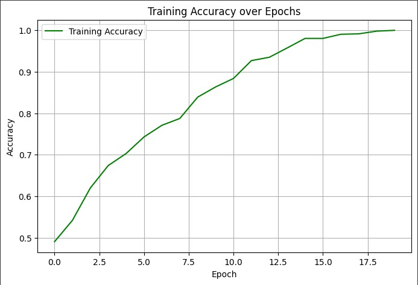
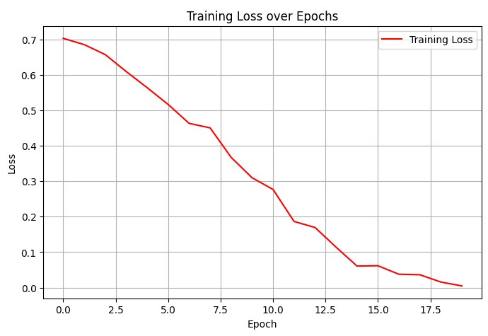

# 🐱🐶 Cat vs Dog Image Classifier using CNN

A deep learning project that classifies images of cats and dogs using a custom-built Convolutional Neural Network (CNN) in TensorFlow/Keras. Trained on image data flattened into CSV format and reshaped back for model input.

---

## 📂 Dataset

The dataset used in this project is structured as follows:

- `input.csv`: Training images (1999 samples, each 100x100x3 = 30,000 pixels flattened)
- `label.csv`: Binary labels (0 = Cat, 1 = Dog)
- `input_test.csv` & `label_test.csv`: Unused in current version

Images are normalized and reshaped to `(100, 100, 3)` for training.

---

## 🛠️ Preprocessing

- Loaded CSV data using `pandas`
- Normalized pixel values to `[0, 1]` range
- Reshaped flattened input arrays into images
- Split into training and validation sets (80/20)

---

## 🧠 Model Architecture

The CNN model was built using `Sequential` API:
Conv2D(32) → MaxPooling2D →
Conv2D(64) → MaxPooling2D →
Flatten → Dense(64) → Dense(1, sigmoid)


- **Loss Function**: Binary Crossentropy  
- **Optimizer**: Adam  
- **Metric**: Accuracy

---

## 🏋️ Training

- **Epochs**: 10  
- **Batch Size**: 32  
- **Validation Split**: 0.2  
- **Runtime Environment**: Google Colab (T4 GPU)

---

## 📈 Evaluation

### 📊 Accuracy Curve


### 📉 Loss Curve



You can find these graphs in the output cells of the notebook.

---

## 💾 Model Saving

To save the trained model:
```python
model.save("cat_dog_classifier.h5")

